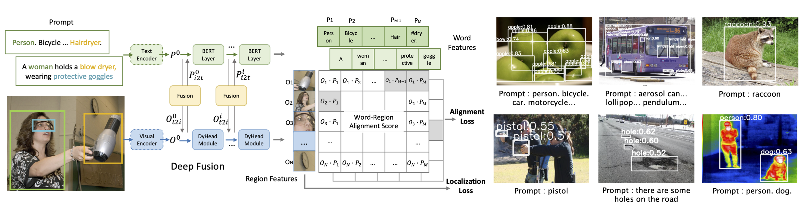

# GLIP: Grounded Language-Image Pre-training  

 


## Updates
06/16/2022: ODinW benchmark released! GLIP-T A&B released!

06/13/2022: GLIPv2 is on Arxiv https://arxiv.org/abs/2206.05836!

04/30/2022: Updated [Demo](https://colab.research.google.com/drive/12x7v-_miN7-SRiziK3Cx4ffJzstBJNqb?usp=sharing)!

04/14/2022: GLIP has been accepted to CVPR 2022 as an oral presentation! First version of code and pre-trained models are released!

12/06/2021: GLIP paper on arxiv https://arxiv.org/abs/2112.03857.

11/23/2021: Project page built. <br/>

## Introduction
This repository is the project page for [GLIP](https://arxiv.org/abs/2112.03857).  GLIP demonstrate strong zero-shot and few-shot transferability to various object-level recognition tasks. 

1. When directly evaluated on COCO and LVIS (without seeing any images in COCO), GLIP achieves 49.8 AP and 26.9 AP, respectively, surpassing many supervised baselines.
2. After fine-tuned on COCO, GLIP achieves 60.8 AP on val and 61.5 AP on test-dev, surpassing prior SoTA.
3. When transferred to 13 downstream object detection tasks, a few-shot GLIP rivals with a fully-supervised Dynamic Head.

We provide code for:

1. **pre-training** GLIP on detection and grounding data;
2. **zero-shot evaluating** GLIP on standard benchmarks (COCO, LVIS, Flickr30K) and custom COCO-formated datasets;
3. **fine-tuning** GLIP on standard benchmarks (COCO) and custom COCO-formated datasets;
4. **a Colab demo**.
5. Toolkits for **the Object Detection in the Wild Benchmark (ODinW)** with 35 downstream detection tasks.

Please see respective sections for instructions.

## Demo
Please see a Colab demo at [link](https://colab.research.google.com/drive/12x7v-_miN7-SRiziK3Cx4ffJzstBJNqb?usp=sharing)!

## The Object Detection in the Wild Benchmark
ODinW was first proposed in GLIP and refined and formalized in [ELEVATER](https://arxiv.org/pdf/2204.08790.pdf). GLIP used 13 downstream tasks while the full ODinW has 35 downstream tasks. It will be hosted as a challenge at [the CV in the Wild Workshop @ ECCV 2022](https://computer-vision-in-the-wild.github.io). We hope our code encourage the community to participate in this challenge!

 Please see [odinw/README.md](odinw/README.md) for instructions.

## Installation and Setup

***Environment***
This repo requires Pytorch>=1.9 and torchvision. We recommand using docker to setup the environment. You can use this pre-built docker image ``docker pull pengchuanzhang/maskrcnn:ubuntu18-py3.7-cuda10.2-pytorch1.9`` or this one ``docker pull pengchuanzhang/pytorch:ubuntu20.04_torch1.9-cuda11.3-nccl2.9.9`` depending on your GPU.

Then install the following packages:
```
pip install einops shapely timm yacs tensorboardX ftfy prettytable pymongo
pip install transformers 
python setup.py build develop --user
```

***Backbone Checkpoints.*** Download the ImageNet pre-trained backbone checkpoints into the ``MODEL`` folder. 
```
mkdir MODEL
wget https://penzhanwu2bbs.blob.core.windows.net/data/GLIPv1_Open/models/swin_tiny_patch4_window7_224.pth -O swin_tiny_patch4_window7_224.pth
wget https://penzhanwu2bbs.blob.core.windows.net/data/GLIPv1_Open/models/swin_large_patch4_window12_384_22k.pth -O swin_large_patch4_window12_384_22k.pth
```


## Model Zoo

Model | COCO [1] | LVIS [2] | LVIS [3] | ODinW [4] | Pre-Train Data | Config  | Weight
-- | -- | -- | -- | -- | -- | -- | --
GLIP-T (**A**) | 42.9 / 52.9 | - | 14.2 | ~28.7 | O365 | [config](configs/pretrain/glip_A_Swin_T_O365.yaml) | [weight](https://penzhanwu2bbs.blob.core.windows.net/data/GLIPv1_Open/models/glip_a_tiny_o365.pth)
GLIP-T (**B**) | 44.9 / 53.8  | - | 13.5 | ~33.2 | O365 | [config](configs/pretrain/glip_Swin_T_O365.yaml) | [weight](https://penzhanwu2bbs.blob.core.windows.net/data/GLIPv1_Open/models/glip_tiny_model_o365.pth)
GLIP-T (**C**) | 46.7 / 55.1 | 14.3 | [17.7](https://penzhanwu2bbs.blob.core.windows.net/data/GLIPv1_Open/models/glip_tiny_model_o365_goldg_lvisbest.pth) | 44.4 | O365,GoldG | [config](configs/pretrain/glip_Swin_T_O365_GoldG.yaml) | [weight](https://penzhanwu2bbs.blob.core.windows.net/data/GLIPv1_Open/models/glip_tiny_model_o365_goldg.pth)
**GLIP-T** [5]  | 46.6 / 55.2  | 17.6  | [20.1](https://penzhanwu2bbs.blob.core.windows.net/data/GLIPv1_Open/models/glip_tiny_model_o365_goldg_cc_sbu_lvisbest.pth) | 42.7 | O365,GoldG,CC3M,SBU | [config](configs/pretrain/glip_Swin_T_O365_GoldG.yaml) [6] | [weight](https://penzhanwu2bbs.blob.core.windows.net/data/GLIPv1_Open/models/glip_tiny_model_o365_goldg_cc_sbu.pth)
**GLIP-L** [7] | 51.4 / 61.7 [8]  | 29.3 | [30.1](https://penzhanwu2bbs.blob.core.windows.net/data/GLIPv1_Open/models/glip_large_model_lvisbest.pth) | 51.2 | FourODs,GoldG,CC3M+12M,SBU | [config](configs/pretrain/glip_Swin_L.yaml) [9] | [weight](https://penzhanwu2bbs.blob.core.windows.net/data/GLIPv1_Open/models/glip_large_model.pth)

[1] Zero-shot and fine-tuning performance on COCO val2017.

[2] Zero-shot performance on LVIS minival (APr) with the last pre-trained checkpoint.

[3] On LVIS, the model could overfit slightly during the pre-training course. Thus we reported two numbers on LVIS: the performance of the last checkpoint (LVIS[2]) and the performance of the best checkpoint during the pre-training course (LVIS[3]).

[4] Zero-shot performance on the 13 ODinW datasets. The numbers reported in the GLIP paper is from the best checkpoint during the pre-training course, which may be slightly higher than the numbers for the released last checkpoint, similar to the case of LVIS.

[5] GLIP-T released in this repo is pre-trained on Conceptual Captions 3M and SBU captions. It is referred in paper in Table 1 and in Appendix C.3. It differs slightly from the GLIP-T in the main paper in terms of downstream performance. We will release the pre-training support for using CC3M and SBU captions data in the next update.

[6] This config is only intended for zero-shot evaluation and fine-tuning. Pre-training config with support for using CC3M and SBU captions data will be updated.

[7] GLIP-L released in this repo is pre-trained on Conceptual Captions 3M+12M and SBU captions. It slightly outperforms the GLIP-L in the main paper because the model used to annotate the caption data are improved compared to the main paper. We will release the pre-training support for using CC3M+12M and SBU captions data in the next update.

[8] Multi-scale testing used.

[9] This config is only intended for zero-shot evaluation and fine-tuning. Pre-training config with support for using CC3M+12M and SBU captions data to be updated.


## Pre-Training


***Required Data.***  Prepare ``Objects365``, ``Flickr30K``, and ``MixedGrounding`` data as in [DATA.md](DATA.md). Support for training using caption data (Conceptual Captions and SBU captions) will be released soon.

***Command.***

Perform pre-training with the following command (please change the config-file accordingly; checkout model zoo for the corresponding config; change the ``{output_dir}`` to your desired output directory):

```
python -m torch.distributed.launch --nnodes 2 --nproc_per_node=16 tools/train_net.py \
    --config-file configs/pretrain/glip_Swin_T_O365_GoldG.yaml \
    --skip-test --use-tensorboard --override_output_dir {output_dir}
```

For training GLIP-T models, we used `nnodes = 2`, `nproc_per_node=16` on 32GB V100 machines. For training GLIP-L models, we used `nnodes = 4`, `nproc_per_node=16` on 32GB V100 machines. Please setup the environment accordingly based on your local machine.


## (Zero-Shot) Evaluation

### COCO Evaluation

Prepare ``COCO/val2017`` data as in [DATA.md](DATA.md). Set ``{config_file}``, ``{model_checkpoint}`` according to the ``Model Zoo``; set ``{output_dir}`` to a folder where the evaluation results will be stored.

```
python tools/test_grounding_net.py --config-file {config_file} --weight {model_checkpoint} \
        TEST.IMS_PER_BATCH 1 \
        MODEL.DYHEAD.SCORE_AGG "MEAN" \
        TEST.EVAL_TASK detection \
        MODEL.DYHEAD.FUSE_CONFIG.MLM_LOSS False \
        OUTPUT_DIR {output_dir}
```

### LVIS Evaluation

We follow MDETR to evaluate with the [FixedAP](https://arxiv.org/pdf/2102.01066.pdf) criterion. Set ``{config_file}``, ``{model_checkpoint}`` according to the ``Model Zoo``. Prepare ``COCO/val2017`` data as in [DATA.md](DATA.md).

```
python -m torch.distributed.launch --nproc_per_node=4 \
        tools/test_grounding_net.py \
        --config-file {config_file} \
        --task_config configs/lvis/minival.yaml \
        --weight {model_checkpoint} \
        TEST.EVAL_TASK detection OUTPUT_DIR {output_dir} 
        TEST.CHUNKED_EVALUATION 40  TEST.IMS_PER_BATCH 4 SOLVER.IMS_PER_BATCH 4 TEST.MDETR_STYLE_AGGREGATE_CLASS_NUM 3000 MODEL.RETINANET.DETECTIONS_PER_IMG 300 MODEL.FCOS.DETECTIONS_PER_IMG 300 MODEL.ATSS.DETECTIONS_PER_IMG 300 MODEL.ROI_HEADS.DETECTIONS_PER_IMG 300
```
If you wish to evaluate on Val 1.0, set ``--task_config`` to ``configs/lvis/val.yaml``.


### ODinW / Custom Dataset Evaluation

GLIP supports easy evaluation on a custom dataset. Currently, the code supports evaluation on [COCO-formatted](https://cocodataset.org/#format-data) dataset.

We will use the [Aquarium](https://public.roboflow.com/object-detection/aquarium) dataset from ODinW as an example to show how to evaluate on a custom COCO-formatted dataset.

1. Download the raw dataset from RoboFlow in the COCO format into ``DATASET/odinw/Aquarium``. Each train/val/test split has a corresponding ``annotation`` file and a ``image`` folder. 

2. Remove the background class from the annotation file. This can be as simple as open "_annotations.coco.json" and remove the entry with "id:0" from "categories". For convenience, we provide the modified annotation files for  Aquarium:
    ```
    wget https://penzhanwu2bbs.blob.core.windows.net/data/GLIPv1_Open/odinw/Aquarium/Aquarium%20Combined.v2-raw-1024.coco/test/annotations_without_background.json -O DATASET/odinw/Aquarium/Aquarium\ Combined.v2-raw-1024.coco/test/annotations_without_background.json
    wget https://penzhanwu2bbs.blob.core.windows.net/data/GLIPv1_Open/odinw/Aquarium/Aquarium%20Combined.v2-raw-1024.coco/train/annotations_without_background.json -O DATASET/odinw/Aquarium/Aquarium\ Combined.v2-raw-1024.coco/train/annotations_without_background.json
    wget https://penzhanwu2bbs.blob.core.windows.net/data/GLIPv1_Open/odinw/Aquarium/Aquarium%20Combined.v2-raw-1024.coco/valid/annotations_without_background.json -O DATASET/odinw/Aquarium/Aquarium\ Combined.v2-raw-1024.coco/valid/annotations_without_background.json
    ```
    
4. Then create a yaml file as in ``configs/odinw_13/Aquarium_Aquarium_Combined.v2-raw-1024.coco.yaml``. A few fields to be noted in the yamls:

    DATASET.CAPTION_PROMPT allows manually changing the prompt (the default prompt is simply concatnating all the categories);

    MODELS.\*.NUM_CLASSES need to be set to the number of categories in the dataset (including the background class). E.g., Aquarium has 7 non-background categories thus MODELS.\*.NUM_CLASSES is set to 8;

4. Run the following command to evaluate on the dataset. Set ``{config_file}``, ``{model_checkpoint}`` according to the ``Model Zoo``. Set {odinw_configs} to the path of the task yaml file we just prepared.

```
python tools/test_grounding_net.py --config-file {config_file} --weight {model_checkpoint} \
      --task_config {odinw_configs} \
      TEST.IMS_PER_BATCH 1 SOLVER.IMS_PER_BATCH 1 \
      TEST.EVAL_TASK detection \
      DATASETS.TRAIN_DATASETNAME_SUFFIX _grounding \
      DATALOADER.DISTRIBUTE_CHUNK_AMONG_NODE False \
      DATASETS.USE_OVERRIDE_CATEGORY True \
      DATASETS.USE_CAPTION_PROMPT True
```

### Flickr30K Evaluation
Prepare ``Flickr30K`` data as in [DATA.md](DATA.md). Set ``{config_file}``, ``{model_checkpoint}`` according to the ``Model Zoo``.

```
python tools/test_grounding_net.py \
        --config-file {config_file} \
        --task_config configs/flickr/test.yaml,configs/flickr/val.yaml \
        --weight {model_checkpoint} \
        OUTPUT_DIR {output_dir} TEST.IMS_PER_BATCH 1 SOLVER.IMS_PER_BATCH 1 TEST.MDETR_STYLE_AGGREGATE_CLASS_NUM 100 TEST.EVAL_TASK grounding MODEL.DYHEAD.FUSE_CONFIG.MLM_LOSS False
```


## Fine-Tuning

### COCO Fine-Tuning
Prepare the ``COCO`` data as in [DATA.md](DATA.md). Set ``{config_file}``, ``{model_checkpoint}`` according to the ``Model Zoo``.

Below is the fine-tuning script for tuning the Tiny models:
```
python -m torch.distributed.launch --nproc_per_node=16 tools/train_net.py \
       --config-file {config_file} \
       --skip-test \
       MODEL.WEIGHT {model_checkpoint} \
       DATASETS.TRAIN '("coco_grounding_train", )' \
       MODEL.BACKBONE.FREEZE_CONV_BODY_AT -1 SOLVER.IMS_PER_BATCH 32 SOLVER.USE_AMP True SOLVER.MAX_EPOCH 24 TEST.DURING_TRAINING False TEST.IMS_PER_BATCH 16 SOLVER.FIND_UNUSED_PARAMETERS False SOLVER.BASE_LR 0.00001 SOLVER.LANG_LR 0.00001 SOLVER.STEPS \(0.67,0.89\) DATASETS.DISABLE_SHUFFLE True MODEL.DYHEAD.SCORE_AGG "MEAN" TEST.EVAL_TASK detection
```

For evaluation, please follow the instructions in ``COCO Evaluation``. Scripts for tuning the Large model will be released soon.

### ODinW / Custom Dataset Fine-Tuning
Prepare the dataset as in ``ODinW / Custom Dataset Evaluation``.

#### Full Model Fine-Tuning

For tuning with 1/3/5/10-shot, set {custom_shot_and_epoch_and_general_copy} to "1_200_8", "3_200_4", "5_200_2", "10_200_1", respectively.

For tuning with all the data, set {custom_shot_and_epoch_and_general_copy} to "0_200_1"; set SOLVER.STEP_PATIENCE to 2; set SOLVER.AUTO_TERMINATE_PATIENCE to 4.

```
python -m torch.distributed.launch --nproc_per_node=4 tools/finetune.py \
      --config-file {config_file}  --ft-tasks {configs} --skip-test \
      --custom_shot_and_epoch_and_general_copy {custom_shot_and_epoch_and_general_copy} \
      --evaluate_only_best_on_test --push_both_val_and_test \
      MODEL.WEIGHT {model_checkpoint} \
      SOLVER.USE_AMP True TEST.DURING_TRAINING True TEST.IMS_PER_BATCH 4 SOLVER.IMS_PER_BATCH 4 SOLVER.WEIGHT_DECAY 0.05 TEST.EVAL_TASK detection DATASETS.TRAIN_DATASETNAME_SUFFIX _grounding MODEL.BACKBONE.FREEZE_CONV_BODY_AT 2 MODEL.DYHEAD.USE_CHECKPOINT True SOLVER.FIND_UNUSED_PARAMETERS False SOLVER.TEST_WITH_INFERENCE True SOLVER.USE_AUTOSTEP True DATASETS.USE_OVERRIDE_CATEGORY True SOLVER.SEED 10 DATASETS.SHUFFLE_SEED 3 DATASETS.USE_CAPTION_PROMPT True DATASETS.DISABLE_SHUFFLE True \
      SOLVER.STEP_PATIENCE 3 SOLVER.CHECKPOINT_PER_EPOCH 1.0 SOLVER.AUTO_TERMINATE_PATIENCE 8 SOLVER.MODEL_EMA 0.0 SOLVER.TUNING_HIGHLEVEL_OVERRIDE full
```

#### Prompt Tuning
Follow the command as in ``Full Model Fine-Tuning``. But set the following hyper-parameters:
```
SOLVER.WEIGHT_DECAY 0.25 \
SOLVER.BASE_LR 0.05 \
SOLVER.TUNING_HIGHLEVEL_OVERRIDE language_prompt_v2
```


## Citations
Please consider citing this paper if you use the code:
```
@inproceedings{li2021grounded,
      title={Grounded Language-Image Pre-training},
      author={Liunian Harold Li* and Pengchuan Zhang* and Haotian Zhang* and Jianwei Yang and Chunyuan Li and Yiwu Zhong and Lijuan Wang and Lu Yuan and Lei Zhang and Jenq-Neng Hwang and Kai-Wei Chang and Jianfeng Gao},
      year={2022},
      booktitle={CVPR},
}
```
