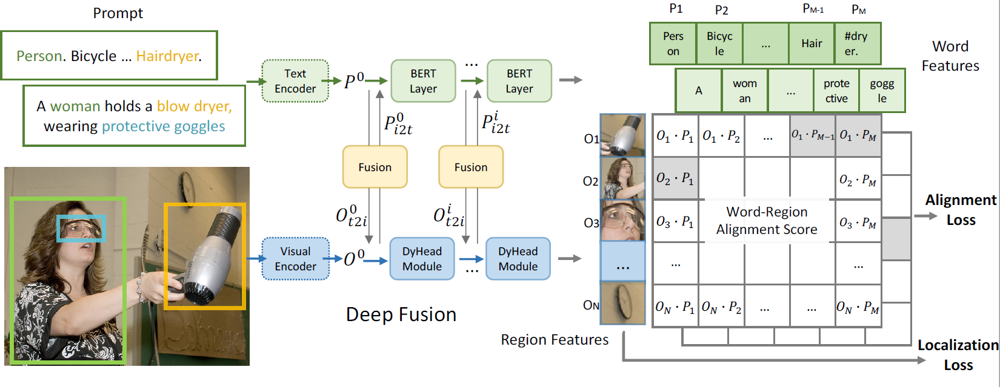

# GLIP: Grounded Language-Image Pre-training  

 

## Updates
12/06/2021: Code and Model are under internal review and will release soon. Stay tuned!

11/23/2021: Project page built. <br/>

## Introduction
This repository is the project page for [GLIP](https://arxiv.org/abs/xxxx), containing necessary instructions to reproduce the results presented in the paper.
This paper presents a grounded language-image pre-training (GLIP) model for learning object-level, language-aware, and semantic-rich visual representations. GLIP unifies object detection and phrase grounding for pre-training.
The unification brings two benefits: 1) it allows GLIP to learn from both detection and grounding data to improve both tasks and bootstrap a good grounding model; 2) GLIP can leverage massive image-text pairs by generating grounding boxes in a self-training fashion, making the learned representation semantic-rich.
In our experiments, we pre-train GLIP on 27M grounding data, including 3M human-annotated and 24M web-crawled image-text pairs.
The learned representations demonstrate strong zero-shot and few-shot transferability to various object-level recognition tasks.
1) When directly evaluated on COCO and LVIS (without seeing any images in COCO during pre-training), GLIP achieves 49.8 AP and 26.9 AP, respectively, surpassing many supervised baselines.
2) After fine-tuned on COCO, GLIP achieves 60.8 AP on val and 61.5 AP on test-dev, surpassing prior SoTA. 
3) When transferred to 13 downstream object detection tasks,  a few-shot GLIP rivals with a fully-supervised Dynamic Head.

Supervised baselines on COCO object detection: Faster-RCNN w/ ResNet50 (40.2) or ResNet101 (42.0) from [Detectron2](https://github.com/facebookresearch/detectron2/blob/main/MODEL_ZOO.md), and [DyHead](https://github.com/microsoft/DynamicHead) w/ Swin-Tiny (49.7).

## Citations
Please consider citing this paper if you use the code:
```
@inproceedings{harold_GLIP2021,
      title={Grounded Language-Image Pre-training},
      author={Liunian Harold Li* and Pengchuan Zhang* and Haotian Zhang* and Jianwei Yang and Chunyuan Li and Yiwu Zhong and Lijuan Wang and Lu Yuan and Lei Zhang and Jenq-Neng Hwang and Kai-Wei Chang and Jianfeng Gao},
      year={2021},
      booktitle={arXiv In Preparation},
}
```

