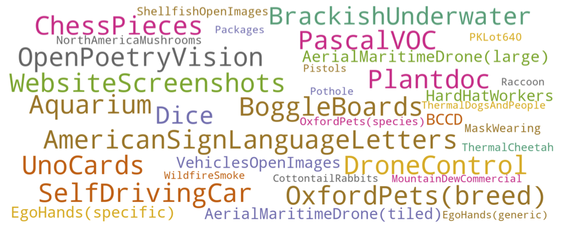

# Object Detection in the Wild  

 
 


## Updates
06/15/2022: ODinW data released! Supports zero-shot evaluation, few-shot fine-tuning, prompt tuning!

## Intro
This folder contains the Object Detection in the Wild (ODinW) dataset. ODinW was introduced in GLIP and initially contained 13 datasets. We further expand the datasets by including more datasets from RoboFlow and the final version contains **35** datasets. 

To distinguish between the two versions, we denote the version used by GLIP as ``ODinW-13`` and the version used by the CVinW workshop as ``ODinW-35``.

## Download ODinW
RoboFlow hosts all the original datasets. We are also hosting the datasets and provide a simple script the download all the data. 
```
python odinw/download_datasets.py
```

``configs/odinw_35`` contain all the meta information of the datasets. ``configs/odinw_13`` are the datasets used by GLIP. Each dataset follows the coco detection format.

## Fine-Tuning and Evaluation

All ODinW datasets are in the COCO format. Fine-tuning scripts and evaluation scripts are provided in the main README.md. Here is a brief recap.

#### Evaluation
``odinw_configs`` can be any of the configs from ``configs/odinw_14`` and ``configs/odinw_35``.
```
python tools/test_grounding_net.py --config-file {config_file} --weight {model_checkpoint} \
      --task_config {odinw_configs} \
      TEST.IMS_PER_BATCH 1 SOLVER.IMS_PER_BATCH 1 \
      TEST.EVAL_TASK detection \
      DATASETS.TRAIN_DATASETNAME_SUFFIX _grounding \
      DATALOADER.DISTRIBUTE_CHUNK_AMONG_NODE False \
      DATASETS.USE_OVERRIDE_CATEGORY True \
      DATASETS.USE_CAPTION_PROMPT True
```

#### Full-Model Fine-Tuning

For tuning with 1/3/5/10-shot, set {custom_shot_and_epoch_and_general_copy} to "1_200_8", "3_200_4", "5_200_2", "10_200_1", respectively.

For tuning with all the data, set {custom_shot_and_epoch_and_general_copy} to "0_200_1"; set SOLVER.STEP_PATIENCE to 2; set SOLVER.AUTO_TERMINATE_PATIENCE to 4.

```
python -m torch.distributed.launch --nproc_per_node=4 tools/finetune.py \
      --config-file {config_file}  --ft-tasks {odinw_configs} --skip-test \
      --custom_shot_and_epoch_and_general_copy {custom_shot_and_epoch_and_general_copy} \
      --evaluate_only_best_on_test --push_both_val_and_test \
      MODEL.WEIGHT {model_checkpoint} \
      SOLVER.USE_AMP True TEST.DURING_TRAINING True TEST.IMS_PER_BATCH 4 SOLVER.IMS_PER_BATCH 4 SOLVER.WEIGHT_DECAY 0.05 TEST.EVAL_TASK detection DATASETS.TRAIN_DATASETNAME_SUFFIX _grounding MODEL.BACKBONE.FREEZE_CONV_BODY_AT 2 MODEL.DYHEAD.USE_CHECKPOINT True SOLVER.FIND_UNUSED_PARAMETERS False SOLVER.TEST_WITH_INFERENCE True SOLVER.USE_AUTOSTEP True DATASETS.USE_OVERRIDE_CATEGORY True SOLVER.SEED 10 DATASETS.SHUFFLE_SEED 3 DATASETS.USE_CAPTION_PROMPT True DATASETS.DISABLE_SHUFFLE True \
      SOLVER.STEP_PATIENCE 3 SOLVER.CHECKPOINT_PER_EPOCH 1.0 SOLVER.AUTO_TERMINATE_PATIENCE 8 SOLVER.MODEL_EMA 0.0 SOLVER.TUNING_HIGHLEVEL_OVERRIDE full
```

#### Prompt Tuning
Follow the command as in ``Full Model Fine-Tuning``. But set the following hyper-parameters:
```
SOLVER.WEIGHT_DECAY 0.25 \
SOLVER.BASE_LR 0.05 \
SOLVER.TUNING_HIGHLEVEL_OVERRIDE language_prompt_v2
```


#### Knowledge-Augmented Inference
GLIP also supports knowledge-augmented inference. Please see [our paper](https://arxiv.org/pdf/2204.08790.pdf) for details. Here we provide an example on how to use external knowledge. Please download a specialized GLIP-A model for knowledge augmented inference ``wget https://penzhanwu2bbs.blob.core.windows.net/data/GLIPv1_Open/models/glip_a_tiny_o365_knowledge.pth -O MODEL/glip_a_tiny_o365_knowledge.pth``.

```
python tools/test_grounding_net.py --config-file configs/pretrain/glip_A_Swin_T_O365.yaml --weight MODEL/glip_a_tiny_o365_knowledge.pth \
      --task_config {odinw_configs} \
      TEST.IMS_PER_BATCH 1 SOLVER.IMS_PER_BATCH 1 \
      TEST.EVAL_TASK detection \
      DATASETS.TRAIN_DATASETNAME_SUFFIX _grounding \
      DATALOADER.DISTRIBUTE_CHUNK_AMONG_NODE False \
      DATASETS.USE_OVERRIDE_CATEGORY True \
      DATASETS.USE_CAPTION_PROMPT True \
      GLIPKNOW.KNOWLEDGE_FILE knowledge/odinw_benchmark35_knowledge_and_gpt3.yaml GLIPKNOW.KNOWLEDGE_TYPE gpt3_and_wiki GLIPKNOW.PARALLEL_LANGUAGE_INPUT True GLIPKNOW.LAN_FEATURE_AGG_TYPE first MODEL.DYHEAD.FUSE_CONFIG.USE_LAYER_SCALE True GLIPKNOW.GPT3_NUM 3 GLIPKNOW.WIKI_AND_GPT3 True
```


## Citations
Please consider citing these papers if you use the code:
```
@inproceedings{li2021grounded,
      title={Grounded Language-Image Pre-training},
      author={Liunian Harold Li* and Pengchuan Zhang* and Haotian Zhang* and Jianwei Yang and Chunyuan Li and Yiwu Zhong and Lijuan Wang and Lu Yuan and Lei Zhang and Jenq-Neng Hwang and Kai-Wei Chang and Jianfeng Gao},
      year={2022},
      booktitle={CVPR},
}
```

```
@article{li2022elevater,
  title={ELEVATER: A Benchmark and Toolkit for Evaluating Language-Augmented Visual Models},
  author={Li, Chunyuan and Liu, Haotian and Li, Liunian Harold and Zhang, Pengchuan and Aneja, Jyoti and Yang, Jianwei and Jin, Ping and Lee, Yong Jae and Hu, Houdong and Liu, Zicheng and others},
  journal={arXiv preprint arXiv:2204.08790},
  year={2022}
}
```

